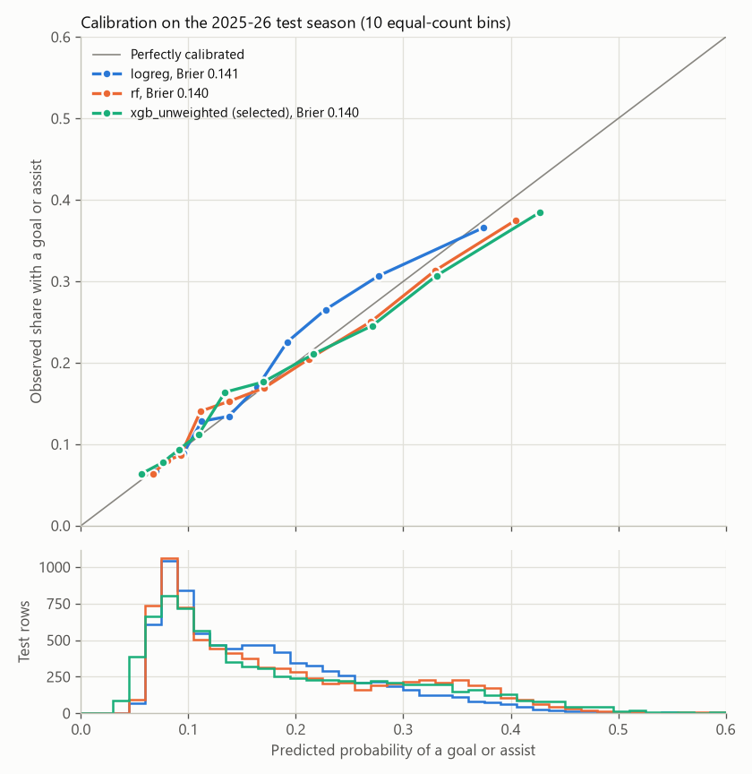
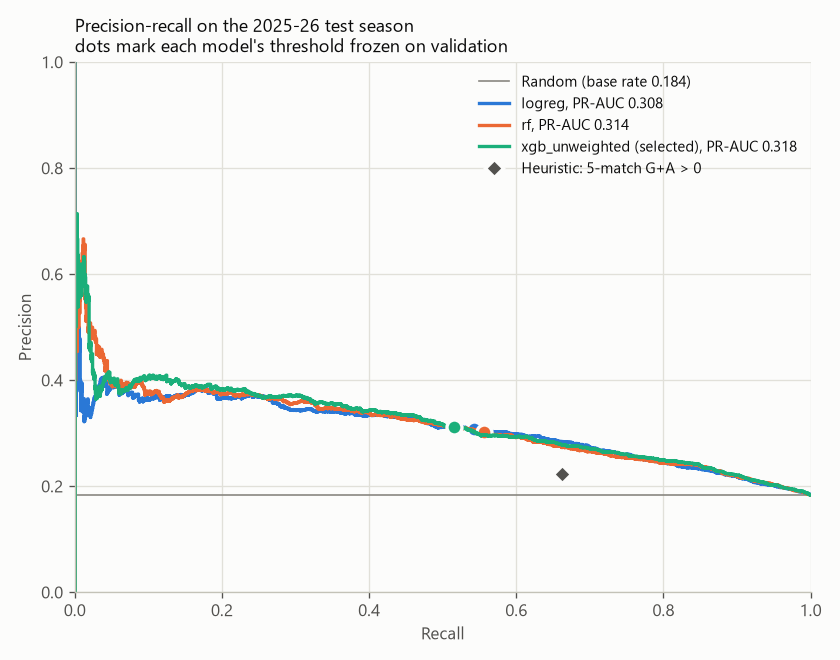

# Premier League goal-or-assist prediction

This project predicts, before kickoff, the probability that a Premier League outfield player records at least one goal or assist in a match, given that the player plays at least 30 minutes. It uses official Fantasy Premier League (FPL) per-gameweek data for six seasons (2020-21 to 2025-26). It builds leakage-safe rolling-form features, trains baselines, logistic regression, a random forest and XGBoost on a chronological split, and evaluates each model once on the held-out 2025-26 season. On that season the selected XGBoost model ranks player-matches clearly better than chance: PR-AUC is 0.318 against a base rate of 0.184, ROC-AUC is 0.689, and its top 20 picks per matchweek contributed 0.387 of the time, against 0.183 for a random player. The edge over simple alternatives is small, though. Ranking players by their career goal-contribution rate hits 0.372. Logistic regression and the random forest are within about 0.01 PR-AUC. No model beats "always predict no" (accuracy 0.816) on accuracy. The same model, unchanged, also scores the upcoming fixtures of the in-progress 2026-27 season (see [Upcoming fixtures](#upcoming-fixtures-2026-27)).

## Results at a glance

Test season 2025-26: 8,107 player-matches with 30+ minutes played. Base rate (share with a goal or assist): 0.184. Selected model: `xgb_unweighted`. The 95% intervals come from a cluster bootstrap over the 38 test matchweeks (see [Uncertainty](#uncertainty)).

| Ranking quality | Selected model | Reference |
|---|---|---|
| PR-AUC | 0.318 [0.298, 0.339] | 0.184 (base rate; the expected PR-AUC of a random ranking) |
| ROC-AUC | 0.689 [0.673, 0.703] | 0.500 (random ranking) |
| Top-20 hit rate per matchweek | 0.387 [0.346, 0.426] | random player 0.183, random forward 0.324, top 20 by career rate 0.372 |

Accuracy is shown as lift over the majority-class baseline (always predict "no goal or assist"), whose accuracy is **0.816**:

| Model | Accuracy at frozen threshold | Lift | Accuracy at fixed 0.5 cutoff | Lift |
|---|---|---|---|---|
| majority | 0.816 | +0.000 | 0.816 | +0.000 |
| heuristic (5-match G+A > 0) | 0.513 | -0.303 | 0.513 | -0.303 |
| logreg | 0.691 | -0.125 | 0.815 | -0.002 |
| rf | 0.682 | -0.134 | 0.817 | +0.001 |
| **xgb_unweighted (selected)** | 0.701 | -0.115 | 0.815 | -0.001 |

The thresholds are F1-maximizing, so they trade accuracy for recall and every model loses accuracy at them. Few predicted probabilities exceed 0.5 (see the histogram under the calibration plot), so at a 0.5 cutoff the models' accuracy is about the baseline's. Metrics are rounded to 3 decimals and ratios ("x") to 2. Every metric and row count in this README comes from the saved pipeline outputs listed under [Repository layout](#repository-layout).

## Data source

FBref was the spec's primary source, but every FBref page, including `robots.txt`, returned a Cloudflare interactive challenge (HTTP 403, "Just a moment...") when checked on 2026-09-28. Getting past it would mean evading bot protection. So the project uses the fallback the spec allows: official **Fantasy Premier League data**, from the [vaastav/Fantasy-Premier-League](https://github.com/vaastav/Fantasy-Premier-League) GitHub archive of per-gameweek FPL API snapshots (`gws/merged_gw.csv`, `players_raw.csv`, `teams.csv`, `fixtures.csv` per season).

- **Seasons:** 2020-21 to 2025-26, six complete seasons of 380 fixtures each. 2026-27 is in progress and excluded from modeling. Its matches so far come from the live FPL API and are used only as history for [upcoming-fixture predictions](#upcoming-fixtures-2026-27).
- **Player key:** FPL's `code`, which is stable across seasons. FPL's per-season `element` id is only used for joining.
- **No shots.** FPL has no shot counts. FPL's `threat` (an Opta-derived attacking-threat index driven mainly by shots and touches in dangerous areas) and `creativity` substitute for shots and shots on target.
- **xG/xA only from 2022-23.** Earlier seasons have no expected stats, so they are missing. The EDA notebook also found that in 2022-23 the archive stores **zeros, not missing values**, until FPL started publishing expected stats at gameweek 16. Cleaning step 4b recodes `xg`/`xa`/`starts` to missing in every gameweek where all of them are 0 (8,491 raw rows in 2022-23 gameweeks 1-6 and 8-15; gameweek 7 was postponed). As a result, only 41.4% of training rows have published xG, against 100% of validation and test rows, so the xG/xA features are optional extras.
- **Assists use FPL's definition**, which is broader than Opta's official one (for example, a saved shot that is scored on the rebound can earn an assist). The target inherits this definition.
- **Position** is the player's FPL classification for the season, not the role played in a given match.
- **"AM" rows are dropped.** Rows whose position is not GK/DEF/MID/FWD are FPL "assistant manager" entries, a game item, not a player. The scraper drops and logs them.
- **Scrape etiquette** (`src/scrape.py`, settings in `config.yaml`):
  - It identifies itself with the user agent `soccer-analytics-student-project/0.1 (educational; python-requests)`.
  - It waits 4 seconds between network requests.
  - It caches every file verbatim under `data/raw/fpl/{season}/` and never re-downloads a cached, non-empty file.
  - It retries timeouts, connection errors, HTTP 429 and 5xx with exponential backoff (up to 4 retries, 30-second timeout).
  - It logs and skips a season whose files fail or lack required columns, and exits non-zero.

| Season | Player-match rows | Fixtures | Unique players | Status |
|---|---|---|---|---|
| 2020-21 | 24,365 | 380 | 713 | ok |
| 2021-22 | 25,447 | 380 | 737 | ok |
| 2022-23 | 26,505 | 380 | 778 | ok |
| 2023-24 | 29,725 | 380 | 865 | ok |
| 2024-25 | 27,283 | 380 | 784 | ok |
| 2025-26 | 29,757 | 380 | 841 | ok |

Source: `data/raw/scrape_log.csv`. Every registered player appears in every gameweek, including players who did not play, which is why the row counts are large.

## Prediction task and design decisions

| Item | Definition |
|---|---|
| Unit of prediction | One outfield player (DEF, MID, FWD) in one Premier League match |
| Target `y` | 1 if goals + assists >= 1 in that match (FPL definitions), else 0 |
| Prediction time | Before kickoff; every feature uses only matches strictly before this one |
| Output | P(y = 1), plus a yes/no call at a threshold frozen on the validation season |

**Minutes filter: option A.** Rows with 0 minutes are not appearances and are dropped. An appearance of under 30 minutes stays in the player's history, where it feeds the rolling-form features, but it is not a prediction row. The model predicts only `eligible` rows (minutes >= 30). Option B from the spec, which keeps every appearance and adds minutes history as a feature, was not built. Below the cut the goal-contribution rate is 0.072, against 0.191 at or above it, so short cameos are a different prediction problem.

**Caveat:** predictions are conditional on the player playing 30+ minutes, which is not known before kickoff. Minutes are not a feature, so the model cannot tell a starter who will be substituted early from one who will play the whole match. The diagnostic below shows the effect on the test season (selected model):

| Minutes played | n | Base rate | Mean predicted | ROC-AUC | PR-AUC |
|---|---|---|---|---|---|
| 30-59 | 1,051 | 0.081 | 0.196 | 0.694 | 0.174 |
| 60-89 | 2,401 | 0.214 | 0.219 | 0.670 | 0.335 |
| 90+ | 4,655 | 0.191 | 0.171 | 0.706 | 0.347 |

Rows with 30-59 minutes are over-predicted by more than a factor of two (0.196 predicted against 0.081 observed). Full-match rows are slightly under-predicted.

## Dataset and cleaning

`src/clean.py` logs row counts before and after each step (`data/processed/cleaning_log.csv`):

| Step | Description | Rows before | Rows after | Removed |
|---|---|---|---|---|
| 0 | Raw player-match rows loaded | 163,082 | 163,082 | 0 |
| 1 | Drop exact duplicate rows | 163,082 | 163,072 | 10 |
| 2 | Deduplicate on (player_id, date) | 163,072 | 163,072 | 0 |
| 3 | Drop rows missing date, player_id or minutes | 163,072 | 163,072 | 0 |
| 4 | Fill missing count stats with 0 (xg/xa/starts stay missing) | 163,072 | 163,072 | 0 |
| 4b | Recode unpublished 2022-23 xg/xa/starts zeros to missing (8,491 rows changed) | 163,072 | 163,072 | 0 |
| 5 | Drop goalkeepers | 163,072 | 144,894 | 18,178 |
| 6 | Drop minutes == 0 (not an appearance) | 144,894 | 62,054 | 82,840 |
| 6b | Flag `eligible` = minutes >= 30 (flag only; "rows after" is the eligible count) | 62,054 | 48,248 | 13,806 not eligible |
| 7 | Sort by player_id, date | 62,054 | 62,054 | 0 |

**Final dataset.** There are 62,054 appearances by 1,270 outfield players, with kickoffs from 2020-09-12 to 2026-05-24. Of these, **48,248 are eligible prediction rows** (`data/processed/features.parquet`). Opponent features come from 4,560 team-match rows (2,280 fixtures).

**Base rate**, measured with `y.value_counts(normalize=True)` on the eligible rows in `notebooks/01_eda.ipynb`:

| Rows | n | P(y = 0) = majority-class accuracy | P(y = 1) = base rate |
|---|---|---|---|
| All seasons | 48,248 | 0.809 | 0.191 |
| Train (2020-21 to 2023-24) | 32,038 | 0.807 | 0.193 |
| Validation (2024-25) | 8,103 | 0.809 | 0.191 |
| Test (2025-26) | 8,107 | 0.816 | 0.184 |

A player who plays 30+ minutes records a goal or assist about 19% of the time. Position matters most: the base rate is 0.097 for DEF (19,535 rows), 0.230 for MID (23,059) and 0.355 for FWD (5,654). Home rows have a higher base rate than away rows (0.205 against 0.177).

## Features

There are 32 features (`config.yaml` `feature_columns`). Each is computed per player across teams and seasons, from appearances strictly before the match:

- **Rolling form (16):** the mean over the previous 5 and 10 appearances of goals, assists, goals + assists, minutes, threat, creativity, xG and xA (`{stat}_roll5`, `{stat}_roll10`).
- **Per-90 rates (6):** goals, assists and threat per 90 minutes over the same windows (`{stat}_p90_roll5/10`). They are missing if the window holds under 90 minutes.
- **History (3):** `matches_in_window` (prior appearances in the 10-match window, 0-10), `prior_matches` (all prior appearances), and `days_since_last_match`.
- **Match context (4):** `is_home` and the position one-hots `pos_DEF`, `pos_MID`, `pos_FWD`.
- **Opponent strength (2):** `opp_conceded_roll5/10`, the opponent's mean goals conceded over its previous 5 and 10 matches (across seasons, never season totals).
- **Player prior (1):** `player_prior_rate`, the expanding mean of `y` over the player's earlier eligible rows. It is missing when the player has fewer than 5 of them.

Missing values stay missing. XGBoost and the random forest handle them natively, and logistic regression imputes the median. Logistic regression uses a 9-feature subset (`logreg_features`): `ga_roll10`, `goals_p90_roll10`, `assists_p90_roll10`, `threat_p90_roll10`, `minutes_roll5`, `is_home`, `pos_MID`, `pos_FWD`, `opp_conceded_roll10`.

**Leakage rule.** Every feature for match *t* uses only matches strictly before *t*. In code, `shift(1)` runs inside each player's (or opponent team's) history, sorted by date, before `rolling(N, min_periods=1)`. The player prior uses a shifted cumulative sum. `tests/test_features_no_leakage.py` enforces the rule in three ways:

- **Perturbation.** Changing row *t*'s own goals, assists, minutes (staying at 30+), threat, creativity, xG or xA, one at a time or all at once, or changing its fixture's score, must leave every feature of row *t* unchanged. The same change must move the features of the player's next appearance, which proves the test is sensitive. Flipping row *t*'s target must leave row *t*'s features unchanged and must move the next eligible row's `player_prior_rate`.
- **Negative control.** The same perturbation check, applied to a deliberately unshifted rolling feature (a player stat and opponent goals conceded), must flag the leak.
- **Real-data truncation.** Rebuilding the features from the real data cut off at three dates (early season, mid-season, and the test-season opener) must give identical features for every row up to the cutoff. Randomizing all later matches must not change earlier features either.

`tests/test_split_is_chronological.py` checks that the seasons are disjoint and the date ranges are ordered, that overlapping or out-of-order configurations raise, and that CV folds only ever train on earlier seasons. The full suite (`pytest -q`) currently reports **108 passed**. It includes app smoke tests, the upcoming-fixture tests (`tests/test_upcoming.py`) and the live-API parsing tests (`tests/test_live.py`). The real-data and app tests skip when their artifacts are missing, so the suite also passes on a checkout without data.

## Split and validation

The split is chronological by season (`src/split.py`, `reports/split_summary.json`). It raises an error if a season is in two sets or if the date ranges overlap.

| Set | Seasons | Rows | Players | Kickoffs (UTC) | Positives | Base rate |
|---|---|---|---|---|---|---|
| Train | 2020-21 to 2023-24 | 32,038 | 865 | 2020-09-12 to 2024-05-19 | 6,170 | 0.193 |
| Validation | 2024-25 | 8,103 | 460 | 2024-08-16 to 2025-05-25 | 1,546 | 0.191 |
| Test | 2025-26 | 8,107 | 443 | 2025-08-15 to 2026-05-24 | 1,489 | 0.184 |

Hyperparameters are tuned by **expanding-window cross-validation over the training seasons**, scored by mean PR-AUC. Shuffled k-fold is never used.

| Fold | Train seasons | Validates on | Train rows | Validation rows | Validation base rate |
|---|---|---|---|---|---|
| 1 | 2020-21 | 2021-22 | 7,926 | 7,958 | 0.187 |
| 2 | 2020-21, 2021-22 | 2022-23 | 15,884 | 8,091 | 0.187 |
| 3 | 2020-21 to 2022-23 | 2023-24 | 23,975 | 8,063 | 0.209 |

The validation season is used for XGBoost early stopping, the frozen thresholds and model selection. The test season is scored only once, by `src.evaluate`.

## Models

- **majority:** always predicts 0, the majority class on train.
- **heuristic:** predicts 1 if the player's 5-match rolling goals + assists (`ga_roll5`) is above 0.
- **logreg:** median imputation, then standardization, then `LogisticRegression` on the 9-feature subset. C was searched over {0.001, 0.01, 0.1, 1, 10} by season CV. C = 10 was chosen, although CV PR-AUC is flat at 0.366 for C >= 0.1.
- **rf:** `RandomForestClassifier` on all 32 features. 8 configurations were sampled from a small grid of 300-tree forests (max_depth, min_samples_leaf, max_features). The chosen forest has max_depth 6, min_samples_leaf 50 and max_features 0.33.
- **xgb_unweighted / xgb_weighted:** a random search of 30 configurations over learning_rate, max_depth, subsample, colsample_bytree and min_child_weight. The number of trees comes from early stopping (patience 50, cap 2000) on each fold's held-out season. The same 30 configurations run twice: unweighted, and with `scale_pos_weight` = negatives/positives on train (4.19). The best configuration of each variant is then fitted on all of train, with early stopping on the validation season to set the number of trees. The selected unweighted model has learning_rate 0.055, max_depth 2, subsample 0.576, colsample_bytree 0.818, min_child_weight 7.8 and 183 trees.

**Validation results.** These models were fit on train only and scored on 2024-25 (`reports/validation_metrics.csv`; search details in `reports/cv_results.csv`):

| Model | CV PR-AUC | Val PR-AUC | Val ROC-AUC | Threshold | Accuracy | Precision | Recall | F1 | Brier |
|---|---|---|---|---|---|---|---|---|---|
| majority | - | 0.191 | 0.500 | 0.5 | 0.809 | 0.000 | 0.000 | 0.000 | 0.191 |
| heuristic | - | 0.239 | 0.616 | 0.5 | 0.556 | 0.259 | 0.713 | 0.380 | 0.444 |
| logreg | 0.366 | 0.365 | 0.716 | 0.200 | 0.695 | 0.340 | 0.638 | 0.444 | 0.140 |
| rf | 0.373 | 0.378 | 0.726 | 0.216 | 0.694 | 0.343 | 0.656 | 0.450 | 0.138 |
| **xgb_unweighted** | 0.377 | **0.382** | 0.727 | 0.241 | 0.707 | 0.349 | 0.622 | 0.447 | 0.138 |
| xgb_weighted | 0.376 | 0.379 | 0.726 | 0.536 | 0.690 | 0.340 | 0.664 | 0.450 | 0.219 |

**Selection.** The final model is the candidate with the highest **validation PR-AUC**: `xgb_unweighted` (0.382). The margins are small. Class weighting did not improve ranking, and it inflated the probabilities (Brier 0.219 against 0.138), which is why its F1 threshold sits at 0.536.

**Refit and thresholds.** logreg, rf and `xgb_unweighted` were refit on train + validation (40,141 rows) with their chosen hyperparameters. XGBoost used a fixed 183 trees, without early stopping. Each model's threshold is the F1-maximizing threshold on its validation predictions, frozen in `models/model_selection.json` before the test season was scored: logreg 0.200, rf 0.216, xgb_unweighted 0.241.

## Test-season results (2025-26)

Each saved model was scored once on the 8,107 test rows with its frozen threshold. Nothing was tuned on test. Sources: `reports/metrics.json` and `reports/metrics_table.md`.

| Model | Accuracy | Lift | Precision | Recall | F1 | ROC-AUC | PR-AUC | Brier |
|---|---|---|---|---|---|---|---|---|
| majority | 0.816 | +0.000 | 0.000 | 0.000 | 0.000 | 0.500 | 0.184 | 0.184 |
| heuristic | 0.513 | -0.303 | 0.222 | 0.662 | 0.333 | 0.570 | 0.209 | 0.487 |
| logreg | 0.691 | -0.125 | 0.307 | 0.543 | 0.392 | 0.684 | 0.308 | 0.141 |
| rf | 0.682 | -0.134 | 0.302 | 0.557 | 0.391 | 0.684 | 0.314 | 0.140 |
| **xgb_unweighted (selected)** | 0.701 | -0.115 | 0.311 | 0.516 | 0.388 | 0.689 | 0.318 | 0.140 |

Lift is accuracy minus the majority-class baseline accuracy (0.816). The majority and heuristic baselines output hard 0/1 scores, so their ROC-AUC, PR-AUC and Brier describe those hard calls. For context, accuracy at a conventional, untuned 0.5 cutoff is 0.815 for logreg (lift -0.002), 0.817 for rf (+0.001) and 0.815 for xgb_unweighted (-0.001). The 0/1 baselines are unchanged at 0.5.

### Uncertainty

The test matchweeks were resampled with replacement (38 clusters, 1,000 resamples, seed 42), with percentile intervals. Paired differences use the same resamples for both models.

| Quantity | Estimate | 95% CI |
|---|---|---|
| xgb_unweighted PR-AUC | 0.318 | [0.298, 0.339] |
| xgb_unweighted ROC-AUC | 0.689 | [0.673, 0.703] |
| rf PR-AUC | 0.314 | [0.293, 0.334] |
| rf ROC-AUC | 0.684 | [0.668, 0.698] |
| logreg PR-AUC | 0.308 | [0.286, 0.331] |
| logreg ROC-AUC | 0.684 | [0.668, 0.701] |
| xgb_unweighted - rf, PR-AUC | +0.004 | [-0.002, +0.010] |
| xgb_unweighted - rf, ROC-AUC | +0.005 | [+0.001, +0.008] |
| xgb_unweighted - logreg, PR-AUC | +0.011 | [+0.001, +0.020] |
| xgb_unweighted - logreg, ROC-AUC | +0.004 | [-0.002, +0.011] |
| Top-20 hit rate | 0.387 | [0.346, 0.426] |
| Top-20 lift vs random player | 2.11x | [1.91, 2.30] |

### By position (xgb_unweighted)

| Position | n | Base rate | Majority baseline | Accuracy | Lift | Precision | Recall | F1 | ROC-AUC | PR-AUC |
|---|---|---|---|---|---|---|---|---|---|---|
| FWD | 911 | 0.323 | 0.677 | 0.431 | -0.246 | 0.346 | 0.857 | 0.493 | 0.589 | 0.391 |
| MID | 3,876 | 0.224 | 0.776 | 0.597 | -0.179 | 0.298 | 0.591 | 0.396 | 0.635 | 0.325 |
| DEF | 3,320 | 0.099 | 0.901 | 0.897 | -0.004 | 0.182 | 0.012 | 0.023 | 0.615 | 0.147 |

Within every position, ROC-AUC (0.589 to 0.635) is well below the overall 0.689, so much of the overall skill comes from telling positions apart. At the single global threshold the model flags almost every forward (recall 0.857) and almost no defenders (recall 0.012).

### Top-20 check (xgb_unweighted)

In each of the 38 test matchweeks, the model's 20 highest-probability players are compared with simpler pickers on the same pool. The pool has one row per player per matchweek; a player with two fixtures in a matchweek keeps the higher-probability one, which removes 84 rows. The hit rate is the share of picks with a goal or assist, averaged over matchweeks.

| Picker | Hit rate | Model lift over this picker |
|---|---|---|
| Model top 20 (xgb_unweighted) | 0.387 | - |
| Top 20 by `player_prior_rate` (career goal-contribution rate) | 0.372 | 1.04x |
| Random forward | 0.324 | 1.20x |
| Random player | 0.183 | 2.11x |

### Calibration



The calibration curve uses 10 equal-count bins of about 811 test rows each. For `xgb_unweighted`, the seven lowest bins have mean predictions from 0.057 to 0.217, and each is within 0.03 of its observed rate (for example, 0.110 predicted against 0.112 observed, and 0.217 against 0.211). The top three bins are **overconfident**: 0.271 predicted against 0.246 observed, 0.331 against 0.307, and 0.427 against 0.385 in the top decile. The random forest looks similar. Logistic regression under-predicts in the middle of its range (0.192 predicted against 0.226 observed). Brier scores are 0.140 (xgb_unweighted), 0.140 (rf) and 0.141 (logreg).

### Confusion matrix and precision-recall curve

At the frozen threshold of 0.241, `xgb_unweighted` catches 768 of the 1,489 goal contributions (recall 0.516), and 0.311 of its "yes" calls are right.

| | Predicted 0 | Predicted 1 |
|---|---|---|
| **Actual 0** | 4,917 | 1,701 |
| **Actual 1** | 721 | 768 |



The confusion matrix is also saved as `reports/figures/confusion_matrix.png`.

## What the model can and can't do

- **It ranks better than chance.** On an unseen season, PR-AUC is 0.318 against a base rate of 0.184, and ROC-AUC is 0.689 [0.673, 0.703]. Its top 20 picks per matchweek hit 0.387 of the time, 2.11x a random player [1.91, 2.30].
- **It beats a random forward, but only just beats a one-feature ranker.** Its top-20 hit rate is 1.20x a random forward's (0.324), but only 1.04x that of ranking by career goal-contribution rate (0.372). Most of the ranking signal is "who usually contributes".
- **It never beats "always no" on accuracy.** At the frozen F1 thresholds every model loses accuracy (xgb_unweighted -0.115). At a 0.5 cutoff the best result is rf's +0.001. The useful output is the ranking and the probability, not the yes/no call.
- **XGBoost, the random forest and logistic regression are practically tied.** Test PR-AUC is 0.318, 0.314 and 0.308, with overlapping intervals. Two of the four paired differences include zero: xgb - rf PR-AUC +0.004 [-0.002, +0.010] and xgb - logreg ROC-AUC +0.004 [-0.002, +0.011]. The other two exclude zero but are at most about 0.01: xgb - logreg PR-AUC +0.011 [+0.001, +0.020] and xgb - rf ROC-AUC +0.005 [+0.001, +0.008]. The tree models add little over a 9-feature logistic regression.
- **Within-position ranking is weak.** Per-position ROC-AUC is 0.589 (FWD), 0.635 (MID) and 0.615 (DEF). With one global threshold, defenders are almost never flagged (recall 0.012), while forwards are flagged almost always (recall 0.857, accuracy 0.431 against a 0.677 baseline).
- **Its probabilities are reasonable in the typical range but overconfident at the top.** Predictions up to about 0.22 are within 0.03 of the observed rates. The top decile predicts 0.427 on average and happens 0.385 of the time.
- **It assumes 30+ minutes.** It over-predicts 30-59-minute appearances (0.196 against 0.081). It knows nothing about lineups, injuries or rotation. The upcoming-gameweek view drops injured or suspended players using FPL's status, but status is not a model input.
- **It is not betting or fantasy advice** (a spec non-goal). It uses no odds, no fantasy prices and no team news.

## Honesty notes

- **XGBoost early-stops on the validation season** (as the spec requires), so its validation numbers are slightly optimistic. The same season also set the thresholds and chose the model. The test season was not used for any choice.
- **Validation-to-test drop.** From 2024-25 to 2025-26, PR-AUC fell from 0.382 to 0.318 (xgb_unweighted), from 0.378 to 0.314 (rf) and from 0.365 to 0.308 (logreg). Part of this is prevalence, since the base rate fell from 0.191 to 0.184. But ROC-AUC, which does not depend on prevalence, also fell: 0.727 to 0.689, 0.726 to 0.684, and 0.716 to 0.684. So 2025-26 was a harder season to rank, not just a rarer one. Its base rate is the lowest of the six seasons, and forwards' base rate dropped to 0.323 from 0.379 in 2024-25. Logistic regression, which does not use early stopping, dropped as well. Note also that the test models were refit on train + validation, so they are not the exact models in the validation table.
- **Thresholds were chosen on validation predictions from the train-only models**, then applied to the models refit on train + validation. This follows the protocol, but the operating point on test can differ slightly from the one chosen on validation.
- **Intervals cover within-season sampling only.** The matchweek bootstrap does not capture season-to-season variation, and there is one test season.
- **Disclosure.** The test season was first scored with models trained before the 2022-23 xG fix (cleaning step 4b). The pipeline was then re-run once because of that data-cleaning fix (found during EDA, not prompted by test results). The selected model's headline test ROC-AUC and PR-AUC were 0.689 and 0.318 in both runs; the pre-fix outputs were overwritten and are not saved.

## Upcoming fixtures (2026-27)

The app's default view scores the upcoming fixtures of the in-progress 2026-27 season with the model evaluated above.

**Data: the live FPL API.** The GitHub archive's 2026-27 folder lagged the season (it held only gameweek 1 when this was built). So `src/live.py` reads the official FPL API (`https://fantasy.premierleague.com/api`), which the spec allows as a source. It fetches `/bootstrap-static/` (players, teams, gameweeks, availability), `/fixtures/`, and `/event/{gw}/live/` for each finished gameweek.
- It reuses the scraper's downloader, so the user agent, the 4-second delay and the retries with backoff are the same.
- Once FPL marks a finished gameweek's data as checked, that gameweek is cached permanently.
- The bootstrap and fixtures snapshots are re-fetched together when either one is older than 6 hours (`snapshot_max_age_hours`), or when you pass `--refresh`.
- For a player with two fixtures in one gameweek, minutes, goals and assists are split per fixture. The per-gameweek stats (threat, creativity, influence, ICT index, xG, xA, bonus points) are divided by each fixture's share of the minutes, or equally if the player had 0 minutes. `starts` is left missing.
- It maps 2026-27 team names to the names used in earlier seasons, so it needs the scrape step's raw `teams.csv` files. Without them, it stops with "run `python -m src.scrape` first".
- A cold run makes 2 snapshot requests plus one per finished gameweek (7 at the time of writing).

The output uses the same raw schemas as the archive. 2026-27 is never added to the modeling seasons.

**How predictions are made** (`src/upcoming.py`):
- **Which fixtures.** While a gameweek is under way, it scores that gameweek's remaining, unstarted fixtures (`current_gw_remaining`). Otherwise it scores the next gameweek (`next_gw`). Some fixtures that affect the scored teams may still be unfinished: postponed or in-play matches from earlier gameweeks, and in-play matches in the target gameweek involving a team that plays again in the scored set. These are counted as `pending_fixtures`. The affected teams' recent form is incomplete, so the app warns about them.
- **Model.** It uses `models/xgb.json`, the `xgb_unweighted` model trained on 2020-21 to 2024-25 and tested on 2025-26, with its frozen threshold of 0.241. Nothing is retrained or re-tuned.
- **History.** The model seasons plus the 2026-27 matches played so far, which go through the same cleaning code.
- **Features.** Each candidate fixture gets one placeholder row, plus placeholder team-match rows, and runs through the same leakage-safe `build_features`. Every feature uses only strictly earlier matches, so the placeholder's own values never reach its features. They equal the features that match will get once it has been played. Fixtures are processed in passes so that no team appears twice in one pass. That way a double gameweek (a player or an opponent with two fixtures) gets features from real history only.
- **Candidates.** Every outfield player at a team with a next-gameweek fixture is a candidate, except those whose FPL status is injured, suspended, unavailable or not in squad (`exclude_status`). Goalkeepers are dropped, as in training.
- **Likely starter.** A candidate is a likely starter if they played 30+ minutes in at least 2 of their current team's last 3 finished matches (`likely_starter_min_matches`, `likely_starter_lookback`).
- **Checks.** `tests/test_upcoming.py` uses synthetic data to check four things. Upcoming features must equal what `build_features` gives the same fixture once appended as played with random stats. Placeholder values and extra future gameweeks must not change them. Double-gameweek fixtures must get history-only features. Candidate selection must follow the definition above. As a backtest on real data, gameweeks 4 and 5 were replayed using only the data available before each one. The features matched the main pipeline's features for those matches exactly.

**Snapshot at the time of writing** (`data/processed/upcoming_meta.json`). Individual predictions are not listed here because they go stale.

| Item | Value |
|---|---|
| Gameweek | 6 of 2026-27 |
| Target mode | `next_gw` (gameweek 5 was finished, so the whole of gameweek 6 is scored) |
| Deadline | 2026-10-10 10:00 UTC |
| Kickoffs | 2026-10-10 11:30 UTC to 2026-10-12 19:00 UTC |
| Data through | 2026-09-20 15:30 UTC (last finished kickoff; gameweeks 1-5) |
| Pending fixtures | 0 |
| Fixtures | 10 |
| Candidate player-fixtures | 432 |
| Likely starters | 208 |

**Caveats:**
- **The 30-minute assumption still applies.** On the test season, 30-59-minute appearances were over-predicted (0.196 predicted against 0.081 observed). The app's "likely starters only" filter, which is on by default, reduces this risk but does not remove it.
- **There are no evaluation numbers for these predictions.** 2026-27 is in progress. The test-season results above are the best available guide to accuracy.
- **Double gameweeks are approximated.** The API reports threat, creativity, xG and xA per gameweek, not per fixture. For a player with two fixtures in one gameweek, these stats are divided by share of minutes. Minutes, goals and assists are exact. This split is an approximation: a player who created most of their threat in one of the two matches gets it spread across both. The affected rows are logged.
- **Promoted teams.** Coventry City and Hull City have no earlier Premier League matches in the data. Their opponent-strength features use only their 2026-27 matches, and many of their players have little form history. The app flags players with fewer than 5 prior appearances.
- **Staleness.** Predictions reflect the snapshot at generation time, and team news changes. The app shows the deadline, the data-through date and the generation time. In `next_gw` mode it warns once the deadline has passed. In remaining-fixtures mode it warns once every listed fixture has kicked off. It also warns when the snapshot is older than 6 hours. To refresh, re-run the two commands below.

```bash
python -m src.live           # fetch 2026-27 from the FPL API (--refresh forces new snapshots)
python -m src.upcoming       # score the target gameweek: data/processed/upcoming.parquet + upcoming_meta.json
```

Both commands need the scrape step's raw `data/raw/fpl/{season}/teams.csv` files and the main pipeline's outputs (`data/processed/clean.parquet`, `team_matches.parquet`, `models/`).

## How to reproduce

You need Python 3.12 or newer. The project was developed on Python 3.14, and the dependencies are pinned. Run everything from the repo root.

```bash
python -m venv .venv
source .venv/bin/activate            # macOS/Linux; see the Windows note below
pip install -r requirements-dev.txt

python -m src.scrape                 # download + normalize FPL data (or: --seasons 2020-21 2021-22 ...)
python -m src.clean                  # data/processed/clean.parquet, team_matches.parquet, cleaning_log.csv
python -m src.features               # data/processed/features.parquet
python -m src.split                  # prints the split summary, writes reports/split_summary.json
python -m src.train                  # CV search, validation metrics, refit; writes models/*
python -m src.evaluate               # one-time test evaluation; writes reports/metrics.json + figures
python -m src.live                   # optional: 2026-27 from the live FPL API (needs src.scrape's raw teams files)
python -m src.upcoming               # optional: upcoming-fixture predictions with the saved model
pytest
jupyter nbconvert --to notebook --execute --inplace notebooks/01_eda.ipynb
streamlit run app/app.py
```

- **Windows:** activate with `.venv\Scripts\activate` (cmd), `.venv\Scripts\Activate.ps1` (PowerShell) or `source .venv/Scripts/activate` (Git Bash). With Smart App Control in Enforce mode, the first import of freshly installed compiled packages (e.g. scipy) can fail with "An Application Control policy has blocked this file". That is an OS reputation check, not a project error.
- `data/raw/` is gitignored, so on a fresh clone the scraper downloads 24 files (6 seasons x 4 files), 4 seconds apart. Later runs use the cache. `src.live` adds 2 snapshot requests plus one per finished 2026-27 gameweek, with the same etiquette.
- Every modeling stage is deterministic. All randomness uses seed 42 (`config.yaml`). Training took 262 seconds on the development machine. `src.live` and `src.upcoming` depend on when you run them, because the live season moves on.
- `data/processed/`, `models/` and `reports/` are not gitignored. A clone that includes them can run the app, the tests and the notebook without re-running the pipeline.

## App

`streamlit run app/app.py` opens a single page that loads the saved model (`models/xgb.json`) and the processed data. It never trains and makes no network calls. Every view shows the note "Model trained on seasons 2020-21 to 2024-25; test-season (2025-26) ROC-AUC = 0.689, PR-AUC = 0.318", read from `reports/metrics.json`, and a "not betting or fantasy advice" disclaimer. A switch at the top picks one of two modes.

**Upcoming gameweek.** This is the default mode when `data/processed/upcoming.parquet` exists. It shows:
- A header reading "Gameweek N" or, while a gameweek is under way, "Gameweek N, remaining fixtures". It shows the deadline, the data-through date and the generation time.
- A staleness warning if the deadline has passed (or, in remaining mode, every listed fixture has kicked off), or if the snapshot is too old. A second warning appears when pending fixtures leave some teams' recent form incomplete.
- A prominent caveat that each probability assumes 30+ minutes, with the test-season over-prediction for 30-59-minute appearances.
- A leaderboard ranked by probability, with player, team, position, opponent, kickoff, probability, call, likely starter, prior appearances and availability (FPL status and news). You can filter by position and team, show likely starters only (on by default), and search by name.
- For a selected player: the gauge, the call, the SHAP contributions, and the last 10 appearances, including 2026-27.

If the upcoming files are missing, the mode shows the two commands to run instead.

**Historical match.** Pick any past player-match from the processed data. It shows:
- A searchable player selector and a match selector with that player's past matches, newest first.
- P(goal or assist) as a number and a gauge, the frozen threshold and the resulting yes/no call, and the actual outcome.
- A flag for matches from the training seasons (2020-21 to 2024-25), whose predictions are in-sample and likely optimistic. 2025-26 matches are marked out-of-sample.
- The top 8 SHAP feature contributions (`shap.TreeExplainer`) with the feature values. If SHAP fails, it falls back to XGBoost gain importance, with a note.
- The player's last 10 appearances before the match, as a table and a small chart.

**Live app: not deployed yet.** Deployment needs the project owner's GitHub and Streamlit accounts. To deploy on Streamlit Community Cloud:

1. Push the repo to GitHub, including `data/processed/*.parquet`, `models/xgb.json`, `models/model_selection.json` and `reports/metrics.json`. `data/raw/` is not needed. For the upcoming view, the parquet files must include `upcoming.parquet`, `current_season_clean.parquet` and `current_season_team_matches.parquet`, and you also need `data/processed/upcoming_meta.json`.
2. On share.streamlit.io, create an app from the repo with main file `app/app.py`. Under Advanced settings, choose Python 3.12 or 3.13.
3. The platform installs `requirements.txt`, which uses `xgboost-cpu` on Linux to keep the install small.
4. Replace the "not deployed yet" line above with the app URL.

The deployed upcoming predictions are a static snapshot. The app never fetches data itself, so they only change when `python -m src.live` and `python -m src.upcoming` are re-run and the four upcoming files above are re-committed. Once the scored fixtures are out of date, the app shows its staleness warning.

## Repository layout

```
.
├── README.md
├── config.yaml                  # seasons, scrape/live settings, feature lists, split, model settings, paths
├── requirements.txt             # pinned runtime dependencies (xgboost-cpu on Linux)
├── requirements-dev.txt         # requirements.txt + pytest, nbformat, nbconvert, ipykernel
├── soccer-analytics-spec.md     # original build spec
├── app/
│   ├── app.py                   # Streamlit app: mode switch, historical view, shared SHAP/last-10 panels
│   └── upcoming_view.py         # upcoming-gameweek view: header, caveat, leaderboard, player details
├── data/
│   ├── raw/                     # gitignored: fpl/{season}/*.csv, player_matches_*.csv, team_matches_*.csv, scrape_log.csv
│   │   └── live/2026-27/        # gitignored: FPL API snapshots (bootstrap, fixtures, event_{gw}_live), players.csv, fixtures.csv, meta.json
│   └── processed/               # clean.parquet, team_matches.parquet, features.parquet, cleaning_log.csv,
│                                # current_season_clean.parquet, current_season_team_matches.parquet,
│                                # upcoming.parquet, upcoming_meta.json
├── models/                      # xgb.json, rf.joblib, logreg.joblib, model_selection.json
├── notebooks/
│   └── 01_eda.ipynb             # EDA: cleaning funnel, base rates, minutes, threat, xG coverage, opponents
├── reports/
│   ├── metrics.json             # test-season metrics, bootstrap CIs, top-k, by position/minutes, calibration bins
│   ├── metrics_table.md         # test-season tables
│   ├── validation_metrics.csv   # validation-season metrics per model
│   ├── cv_results.csv           # every CV search configuration and its fold scores
│   ├── split_summary.json       # split sizes, dates, base rates, CV folds
│   ├── test_predictions.parquet # test rows with p_logreg, p_rf, p_xgb
│   └── figures/                 # calibration.png, pr_curve.png, confusion_matrix.png, eda_*.png
├── src/
│   ├── utils.py                 # repo root, config loading, logging
│   ├── scrape.py                # download + normalize FPL data
│   ├── clean.py                 # cleaning steps and log
│   ├── features.py              # leakage-safe features (pure build_features)
│   ├── split.py                 # chronological split and season folds
│   ├── train.py                 # baselines, CV search, validation, refit
│   ├── eval_stats.py            # top-k check, minutes bands, matchweek bootstrap
│   ├── evaluate.py              # one-time test evaluation, tables, figures
│   ├── live.py                  # 2026-27 from the live FPL API, normalized to the raw schemas
│   └── upcoming.py              # next-gameweek candidates, placeholder features, predictions
└── tests/
    ├── conftest.py              # synthetic fixtures, repo root on sys.path
    ├── test_features_no_leakage.py
    ├── test_split_is_chronological.py
    ├── test_upcoming.py         # upcoming features equal build_features; placeholder and double-gameweek checks
    ├── test_live.py             # src/live.py parsing on synthetic FPL API payloads (no network)
    └── test_app_smoke.py        # Streamlit AppTest smoke tests
```

Agent tooling files (`CLAUDE.md`, `.claude/`, `.claude-flow/`, `.swarm/`) are not part of the project.

## Limitations and possible next steps

- **Conditional on 30+ minutes.** A separate model of P(plays 30+ minutes) from lineup or rotation signals would make the prediction usable before team news. Option B (all appearances, with minutes history as a feature) is the other untested alternative.
- **One data source, no shots.** FPL's `threat`/`creativity` stand in for shots. xG/xA cover only 41.4% of the training rows. Richer event data (shots, touches in the box, set-piece duties) would likely help within-position ranking, which is the weak spot.
- **One test season.** The intervals reflect within-season noise only, and 2025-26 ranked worse than 2024-25. A rolling multi-season backtest would give a more stable estimate.
- **Calibration at the top end.** Isotonic or Platt recalibration fitted on the validation season could fix the overconfident top decile. Per-position thresholds would give defenders a usable yes/no call.
- **Upcoming predictions are unevaluated and static.** 2026-27 forecasts can only be scored once enough of the season has been played. "Likely starter" is a simple recent-minutes rule, not a lineup prediction. Double-gameweek threat, creativity and xG/xA are split by minutes share, which is an approximation. The snapshot only updates when the two commands are re-run, and the app is not deployed yet.
- **Stretch goals.** The upcoming-gameweek leaderboard partly covers the matchweek-leaderboard goal. Its staleness warnings are a basic data-freshness check, but there is no scheduled refresh. Not done: a fantasy-points regression target with a PuLP squad optimizer, and a scheduled data refresh.
